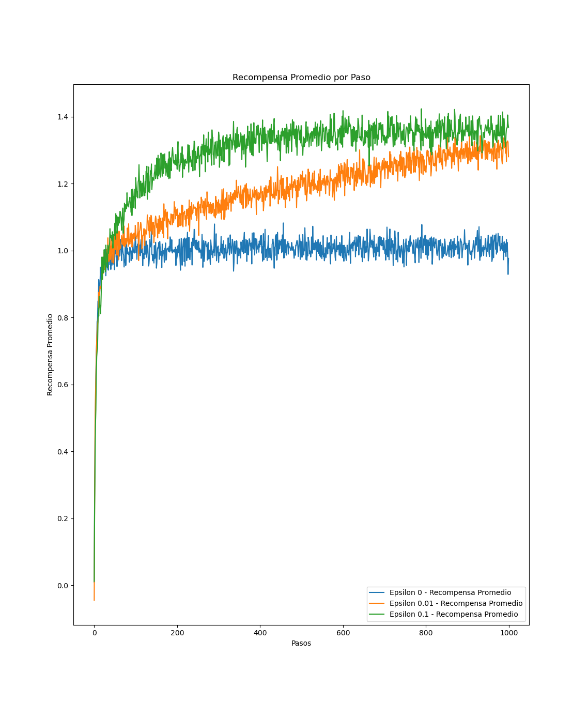
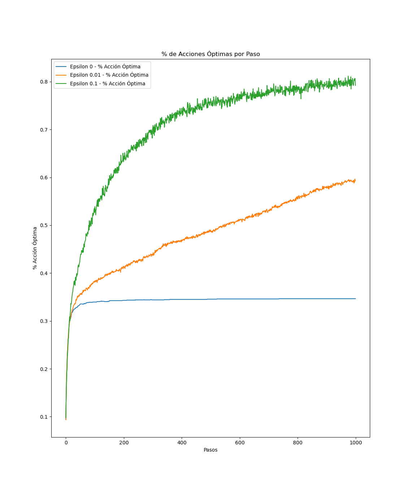
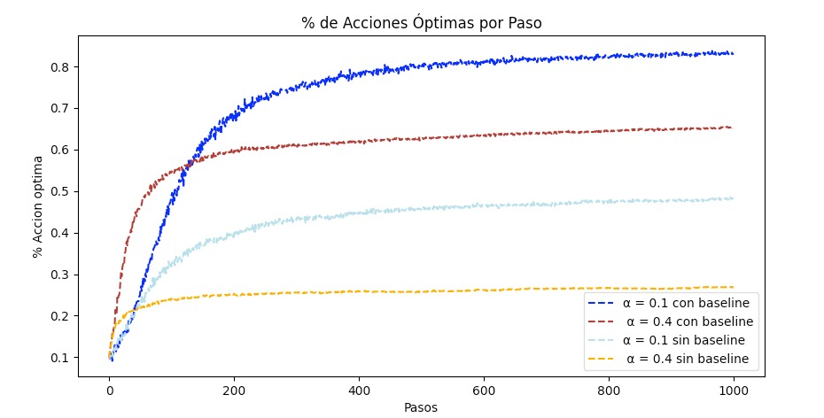

# IIC3675 Reinforcement Learning: Assignment 1 - Bandits

The purpose of this assignment is to familiarize the student with the $\epsilon$-greedy algorithm widely used in reinforcement learning.
The assignemnt description, and tasks can be read in this [PDF](/Tarea%201%20-%20Bandits/Enunciado_T1.pdf).

## Replicating and executing code

By utilizing the `env.yaml` file in the repository, the exact same dependencies, and versions can be used to create the exact same environment for code executing

### Steps to replicate environment

For this step, I have been using `conda` (read more [here](https://anaconda.org/anaconda/conda)). To replicate the environment execute:
`conda env create -f env.yaml`
in your terminal
This should create the exact same environment.

### Executing the code

The code is for task a) is in the file `main.py`, for task c) `main_preguntaC.py`, and for task f) `main_preguntaF.py`.

This yields the plots, and the other tasks are just discussion of the findings in these tasks.

## Tasks

### a) Simple Bandit Algorithm with different $\epsilon$-values

In this task, the **incremental version of the simple bandit algorithm** was implemented as described in **Section 2.4** of *Reinforcement Learning: An Introduction*. The experiment from **Figure 2.2** was replicated using different values of $\epsilon$:

- **$\epsilon = 0$ (greedy strategy):** The agent always selects the action it currently believes to be the best.

- **$\epsilon = 0.01$ (low exploration):** The agent mostly exploits but occasionally explores new actions.

- **$\epsilon = 0.1$ (higher exploration):** The agent explores more frequently, balancing learning and exploitation.

The results from the graphs were like expected. For the value of $\epsilon = 0$ it stabilizes on an average reward of 1, and has an optimal action percentage close to 35%, which makes sense since it does not explore, and only chooses one action. Regarding the other epsilons, we see that the highest $\epsilon$ converges faster, than $\epsilon = 0.01$ due to its more explorative nature. However that $\epsilon = 0.01$ has a steady increase in both average reward, and the percentage of optimal actions taken. Indicating that it will probably converge the same, or supersede the agent with $\epsilon = 0.1$ when the number of steps increases. If this is the desired behavior is, as usual, task dependent.

### b) Simple Bandit Algorithm convergence analysis

Figure 2.2 in *Reinforcement Learning: An Introduction* shows that even with an $\epsilon = 0.1$ the optimal action is only chosen about $80\%$ of the time. The reason being that the agent is unaware of the actual true value, or expected reward, or action $a$ at time $t$, denoted $q_*(a)$. However, the agent only has en estimate of $q_\*(a)$, denoted $Q_{t}(a)$, which is not the true expected reward, but $Q_{t}(a)$ will asymptotically converge towards the true expected value. Written mathematically as follows:

$$
Q_{t}(a) \rightarrow q_{*} (a) \text{ when } t \rightarrow \infty
$$

### c) Simple Bandit Algorithm with optimistic initialization and fixed step-value

This task entails us to make a variation of the *simple bandit algorithm* with a *fixed step size*, $\alpha \in ( 0, 1 ]$ to alter how the agent views, and emphasizes the recent versus older observations. This is shown mathematically by Equation 2.6 in *Reinforcement Learning: An Introduction*. Furthermore, by implementing *optimistic initial values* to the estimates of the actions, the agent will be motivated to explore more in the beginning.
This is shown in the figure below, where we see that the agent in the beginning chooses actions that are not necessarily the optimal, but chooses them because of the inital values. So the first steps deviate from the optimal, but the agent quickly learns and surpasses the realistic agent as expected.

### d) Optimistic agent performance analysis

As seen in the graph for the optimistic agent with $Q_1 = 5$ and $\epsilon = 0$, there is a sudden performance increase followed by a sharp drop. The reason being is that in the beginning the agent encourages self-exploration without the need of randomness (without the need for randomness (since $\epsilon= 0$), leading to the agent choosing the optimal actions. However this process causes some temporary misjudgment, where suboptimal actions may still appear slightly better than the true optimal action due to the imposed initial overestimation, leading to the sharp drop right after the early spike in the graph.

### e) Optimistic agent convergence analysis

As displayed in the graph, the optimistic agent seems to converge to a value of $85\%$ of optimal actions taken. This can be due to several factors. One possibility is that the $\epsilon = 0$, meaning that the agent might favour an suboptimal action due to the stochastic nature of the rewards received, and does not further explore. In other terms, the initial overestimation leads to a wrong action being favored, and this can take a long time to correct.

### f) Gradient Bandit Algorithm

The *Gradient Bandit Algorithm*, contrary to the other bandit algorithms, assigns a preference score to the actions, $H(a)$, instead of estimating the reward of an action $Q(a)$. The preference is set, and updated, using a gradient ascent algorithm, ensuring that actions leading to higher rewards receive higher preference values. The probability of selecting an action is calculated using the *Softmax function*, meaning that action selection is probabilistic rather than purely greedy.

This task involves replicating the experiment from Figure 2.5 in Reinforcement Learning: An Introduction, which evaluates the Gradient Bandit Algorithm with different values of $\alpha \in \{ 0,1, 0.4\}$, both with and without a baseline. The baseline, represented by $\bar{R}_{t}$​, is the running average reward and serves as a reference for whether an action was better or worse than expected. In one experiment, this term is removed from the update rule (Equation 2.12 in *Reinforcement Learning: An Introduction*), effectively making the agent rely only on raw rewards.

The results, as shown in the graph, match expectations. With a lower step size $\alpha$, the agent learns more slowly but more reliably, making it less sensitive to short-term fluctuations. This leads to a higher percentage of optimal actions in the long run.
Conversely, a higher $\alpha$ results in faster learning, but it also overreacts to reward variability, causing more instability in action selection.

Additionally, it is clear that agents without a baseline perform worse, achieving a lower percentage of optimal actions. This happens because the agent lacks a stable reference for evaluating actions. Without a baseline, the agent reacts too strongly to individual rewards, making learning noisier and less efficient.

<!-- This tasks asks to replicate the experiment shown in Figure 2.5 in *Reinforcement Learning: An Introduction* where the gradient bandit algorithm is used with different values of $\alpha \in \{0.1,  0.4 \}$ and with and without baseline. Meaning that in of of the experiments the term $\bar{R}_{t}$ is removed from the updating of the actions preferences, as seen in Equation 2.12. -->

<!-- The results, as shown in the graph below are as expected. With a lower $\alpha$-value the agents learns slower, but is more stable, and not susceptible, and sensitive to fluctuations. Leading to an higher percentage of optimal actions taken. From the graph, it is easy to see that agents without the baseline seem to have a lower percentage of optimal actions taken. The intuition behind this is that the agent does not have any prior knowledge like this with a baseline. Meaning that it is more prone to fluctuations, and lead to erratic learning.  -->

<!-- g) Using $\mu + 4$ impacts the values in experiments without a baseline. When a baseline is used, the values are adjusted to the mean, ensuring the results remain unaffected. However, $\mu + 4$ influences performance because preference updates, $H(a)$, do not adjust to the mean of the rewards. In contrast, setting $\mu + 4$ ensures performance remains unchanged, whether a baseline is used or not, since the rewards are naturally centered around $0$, which serves as the baseline value. -->

### g) Effect of Using $\mu = 0$ Instead of $\mu = 4$

In the previous experiment, the expected values of each arm were sampled from $q_\*(a) \sim \mathcal{N}(4,1)$, meaning they were centered around $4$. If instead we had used $\mu = 0$ (i.e., $q_\*(a) \sim \mathcal{N}(0,1)$), this would have had a significant effect on experiments without a baseline, while experiments with a baseline would remain largely unaffected.

When a baseline is used, the agent adjusts preferences relative to the mean reward. This means that whether $\mu = 0$ or $\mu = 4$, the agent still compares rewards relative to past experience, so the learning dynamics remain the same.

However, in experiments without a baseline, changing $\mu$ affects performance. Since preference updates ($H(a)$) rely directly on received rewards, they do not naturally adjust to the mean reward distribution. If the expected rewards are centered at 0, the updates behave differently compared to when they are centered at 4, affecting how preferences develop over time.

In summary **with a baseline** the results would remain unchanged, since preferences adjust relative to the running mean of rewards. However **without a baseline** the results would change, as preference updates would be influenced by whether rewards are naturally centered around 0 or 4.
